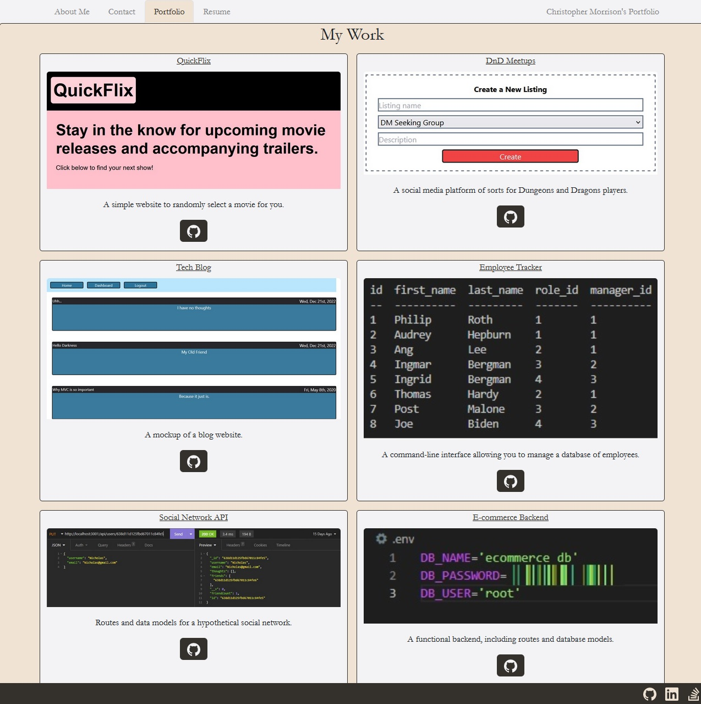
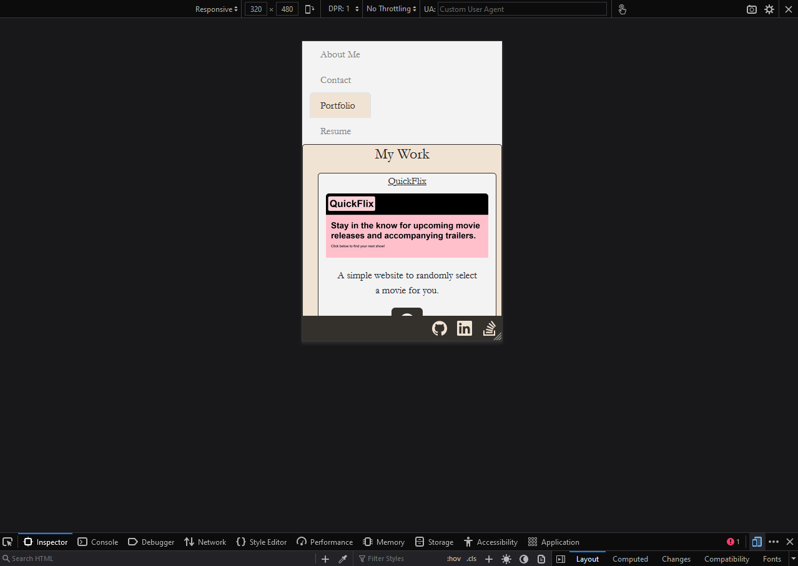

# react-portfolio

Here we have a prime example of a portfolio made using React. I used https://coolors.co/ to select a neutral, professional-looking color scheme. I chose Bootstrap version 4.6 for the styling. 

I implemented routing using the following if-statement, with corresponding logic on the navigation tabs: 
```
const renderPage = () => {

    if (currentPage === "About") {
      return <About />;
    }
    if (currentPage === "Contact") {
      return <Contact />;
    }
    if (currentPage === "Portfolio") {
      return <Portfolio />;
    }
    return <Resume />;
  };

```
My portfolio is mobile-responsive:





I plan to refactor and add to the code in the future. One change will be to implement React's ```<Router />``` component, and another will be to use the React-specific version of Bootstrap (or perhaps Tailwind). These changes should increase my code's functionality and make it easier to implement further changes. Other, smaller revisions will include adding more information to the About Me section and making sure the Contact forms work.